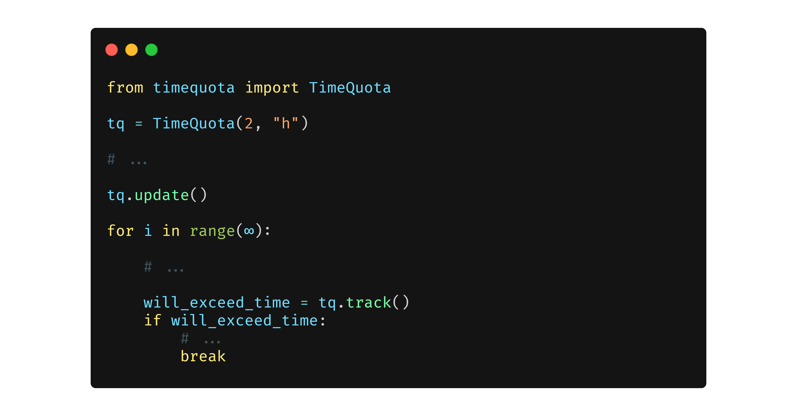

 

  
  <h3 align="center">timequota</h3>
  <h4 align="center"><code>pip install -U timequota</code></h4>
  

    Manage the time of your python script.
      
    <a href="https://pypi.org/project/timequota/">PyPI</a>
    ·
    
    ·
    <a href="https://aravrs.github.io/timequota">Docs</a>
    ·
    <a href="https://github.com/aravrs/timequota/blob/main/CHANGELOG.md">Changelog</a>
  

